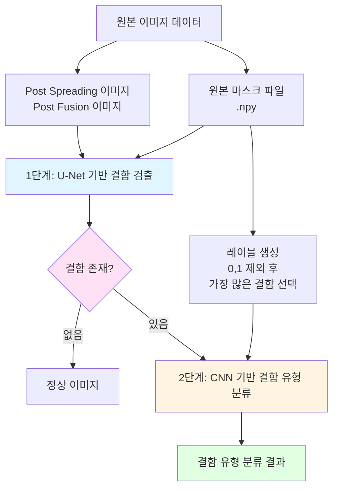
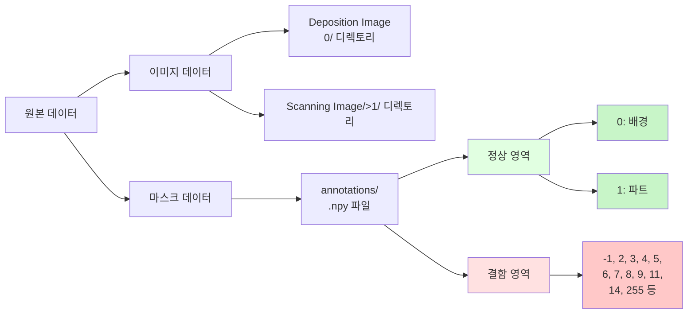
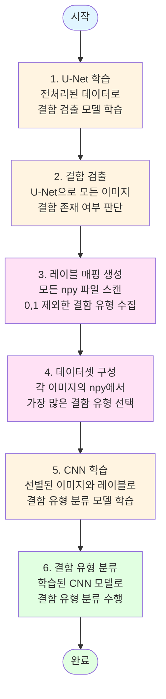

# Federated Learning for Additive Manufacturing (FLAM) - 결함 검출 및 분류

## 프로젝트 개요

본 프로젝트는 2단계 파이프라인을 통해 적층 제조 공정의 결함을 검출하고 분류합니다.

### 전체 파이프라인 흐름도



## 2단계 파이프라인

### 1단계: U-Net 기반 결함 검출

- **목적**: 이미지 전체를 입력받아 결함이 있는지 없는지를 판단
- **입력**: 이미지 전체 (Post Spreading + Post Fusion 이미지)
- **출력**: 결함 존재 여부 판단 (이진 분류: 결함 있음/없음)
- **학습 데이터**: 
  - 전처리된 npy 파일 사용 (모든 결함 유형이 클래스 2로 통합됨)
  - 연합 학습(Federated Learning) 방식으로 학습

### 2단계: CNN 기반 결함 유형 분류

- **목적**: 결함이 발견된 이미지에 대해 결함 유형을 분류
- **입력**: 이미지 전체 (Post Spreading + Post Fusion 이미지)
- **출력**: 결함 유형 분류 (다중 클래스 분류)
- **학습 데이터**:
  - 원본 npy 파일에서 결함 유형 숫자 값들을 확인
  - **정상 부분 제외**: `0`(배경)과 `1`(파트)은 정상 부분이므로 제외
  - **결함 인식**: 나머지 값들(`-1`, `2`, `3`, `4`, `5`, `6`, `7`, `8`, `9`, `11`, `14`, `255` 등)은 모두 결함으로 인식
  - **대표 결함 선택**: 각 이미지의 npy 파일에서 0과 1을 제외한 결함 중 **가장 픽셀 수가 많은 결함 유형**을 해당 이미지의 레이블로 사용
  - 예: 이미지 A의 npy 파일에 `[0, 0, 1, 1, 3, 3, 3, 5, 5]`가 있다면, `0`과 `1`을 제외하고 `3`이 3번으로 가장 많으므로 이미지 A의 레이블은 `3`

## 핵심 포인트

1. **결함 영역 추출 불필요**: 결함 영역을 개별적으로 추출하지 않고, 이미지 전체를 CNN에 입력
2. **이미지 단위 분류**: 각 이미지 전체를 하나의 샘플로 사용하여 결함 유형을 분류
3. **정상 부분 제외**: `0`(배경)과 `1`(파트)은 정상 부분으로 인식하여 결함 분류에서 제외
4. **레이블 생성 방법**: 원본 npy 파일에서 0과 1을 제외한 결함 유형 숫자 값들의 빈도를 계산하여 가장 픽셀 수가 많은 결함 유형을 선택
5. **연합 학습**: 여러 클라이언트에 분산된 데이터로 연합 학습을 수행하여 프라이버시를 보호하면서 모델을 학습

## 데이터 구조

### 디렉토리 구조

```
data/
├── 0/                    # Post Spreading 이미지 (.jpg)
├── 1/                    # Post Fusion 이미지 (.jpg)
└── annotations/          # 원본 마스크 파일 (.npy)
    ├── 0: 배경 (정상, 결함 아님)
    ├── 1: 파트 (정상, 결함 아님)
    └── -1, 2, 3, 4, 5, 6, 7, 8, 9, 11, 14, 255 등: 결함 유형
```

### 데이터 구조 다이어그램



- **0/**: Post Spreading 이미지 (`.jpg`)
- **1/**: Post Fusion 이미지 (`.jpg`)
- **annotations/**: 원본 마스크 파일 (`.npy`)
  - `0`: 배경 (정상, 결함 아님)
  - `1`: 파트 (정상, 결함 아님)
  - `-1`, `2`, `3`, `4`, `5`, `6`, `7`, `8`, `9`, `11`, `14`, `255` 등: 결함 유형

## 워크플로우

### 전체 워크플로우 다이어그램



### 상세 단계

1. **U-Net 학습**: 전처리된 데이터로 U-Net 모델 학습 (결함 검출)
2. **결함 검출**: U-Net으로 모든 이미지에 대해 결함 존재 여부 판단
3. **레이블 매핑 생성**: 모든 npy 파일을 스캔하여 0과 1을 제외한 결함 유형만 수집하고 레이블 매핑 생성
4. **데이터셋 구성**: 각 이미지의 npy 파일에서 0과 1을 제외한 결함 중 가장 픽셀 수가 많은 결함을 레이블로 지정
5. **CNN 학습**: 선별된 이미지와 생성된 레이블로 CNN 모델 학습 (결함 유형 분류)
6. **결함 유형 분류**: 학습된 CNN 모델로 결함 유형 분류 수행
